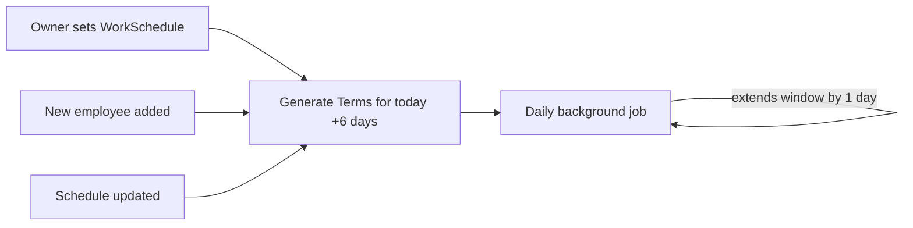
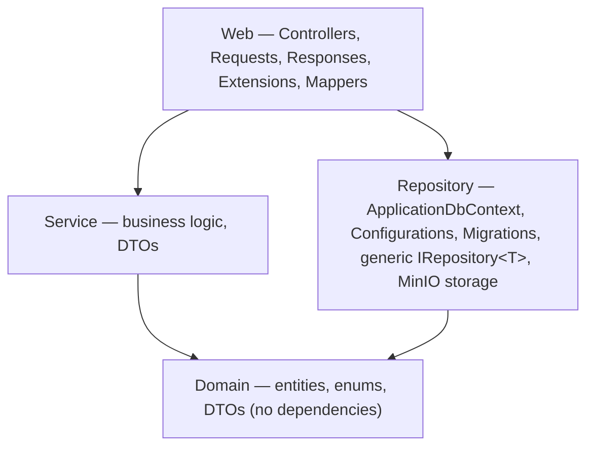

# Need — Application Documentation

**Status:** Working prototype. Not production-hardened.

---

## 1. Overview

**Need** is a two-sided marketplace app for booking appointments at local, physical-service businesses — hair salons, barbershops, gyms, spas, and similar. It connects three kinds of people around a business:

- **Customers**, who browse businesses and book appointments with a specific employee at a specific time.
- **Owners**, who register a business, staff it, set its working hours, and manage the bookings that come in.
- **Employees**, who work at a business and can see the bookings assigned to them.

A single account can hold more than one of these roles at once — an owner can also work at their own business and separately book appointments elsewhere as a customer. Nothing about the identity system assumes a person is only ever one thing.

The core idea the whole system is built around: an owner doesn't manually create appointment slots. They set a **schedule** once (which days they're open, what hours, how long one appointment takes), and the system automatically keeps a rolling window of real, bookable time slots generated for every active employee — always extending itself forward, day by day, with no manual upkeep.

---

## 2. Key Concepts

### Roles
| Role     | Granted when                           | Can                                                       |
|----------|----------------------------------------|-----------------------------------------------------------|
| Customer | Implicit for any account               | Browse, book, review                                      |
| Owner    | The moment a user registers a business | Manage that one business — staff, hours, photos, bookings |
| Employee | Added by an owner via email            | See their assigned business and their own bookings        |
| Admin    | Assigned manually                      | Bypasses ownership checks; manages categories             |

A business is capped at **one per owner**. An account can't be an active employee at more than one business at a time, but *can* simultaneously own a business, work at it, and book elsewhere as a customer.

### Businesses & Categories
Every business belongs to a fixed, admin-managed **category** (e.g. "Hair Salon," "Fitness," "Beauty") — this is what powers category filtering and the colored category tags shown throughout the app. Businesses aren't open registration for any kind of business — the category list is deliberately curated toward services that happen in person.

### The Rolling Schedule → Term System
This is the mechanism the entire booking flow depends on:

1. An owner defines a **WorkSchedule**: which days they operate, the hours for *each* day (independently — Tuesday can differ from Wednesday), and how long one appointment slot lasts.
2. The system generates **Terms** (individual bookable time slots) for every active employee, covering **today through six days from now** — a constant 7-day rolling window.
3. Every day, a background job extends that window forward by exactly one more day, so it never runs out.
4. Adding a new employee, or changing the schedule, immediately regenerates the window rather than waiting for the next day's job.



A **Term** starts `Available`. A customer booking it flips it to `Booked` and creates a **Booking** record. Cancelling frees the Term back to `Available`. Once a Term's time has passed, its Booking is automatically marked `Completed` by another daily job — which is also what unlocks the ability to leave a review.

### Bookings & Reviews Lifecycle
```
Confirmed → Completed (automatic, once the appointment time passes)
Confirmed → CancelledByCustomer / CancelledByBusiness (manual)
```
Only a `Completed` booking can be reviewed, and only by the customer who made it — one review per booking. A business's average rating and review count are recalculated and stored directly on the business every time a review is created, edited, or deleted, so browsing screens can show a rating without querying every individual review.

---

## 3. Features

### As a Customer
- Browse all businesses, or filtered by category
- Search businesses by name
- Home screen: personalized greeting, quick search, category shortcuts, a "Top Rated" carousel, a "New Businesses" carousel, and a card for your next upcoming appointment (if any)
- Business detail page: photo gallery (swipeable), logo, open/closed status with next opening time, rating & review count, tap-to-open directions, tap-to-open website, description, category, full weekly hours
- Full review list for any business
- Book an appointment: pick an employee, pick a day and time (available slots shown in green, already-booked slots in red), add an optional note
- View your own bookings, split into Upcoming / Completed / Cancelled tabs
- Cancel an upcoming booking
- Leave, edit, or delete a review on a completed booking

### As a Business Owner
- Register a business (name, description, address, website, category)
- Upload a logo and up to 5 gallery photos, from camera or gallery
- Edit business details, or delete the business
- Add employees by email (they must already have a Need account)
- Deactivate / reactivate employees
- Set the weekly schedule — any combination of days, independent hours per day, appointment duration
- View every booking made against the business, and cancel any of them
- View all reviews left for the business

### As an Employee
- See which business you work at, from your profile
- View your own assigned bookings (Upcoming / Completed / Cancelled) — view-only in this version, cancellation isn't available to employees yet

### For Everyone
- Register / log in with email and password (Firebase Authentication)
- "Remember me" pre-fills your email on your next login
- Edit your own name from your profile

---

## 4. How to Use the App

### Getting Started
1. Open the app — you land on the Home tab, fully browsable without an account.
2. Tap **Book Now** on any business — it prompts you to log in or register if you haven't already.
3. Registering asks for first name, last name, email, and password, plus agreement to Terms (placeholder for now).

### Booking an Appointment
1. Find a business (Home, Explore, or search) and open its detail page.
2. Tap **Book Now**.
3. Pick an employee from the horizontal list.
4. Pick a day, then a time — green means available, red means already taken.
5. Optionally add a note for the business.
6. Confirm. You'll find it under Bookings → Upcoming.

### Registering a Business
1. From Profile, tap **Register your business**.
2. Fill in the business's details and category, then submit.
3. You're taken straight to **Manage Photos** to add a logo and gallery images (skippable).
4. From your business's edit screen, set up **Working Hours** — nothing is bookable until this is done — and **Manage Employees** to add staff by email.

### Managing Bookings (Owner)
From your business's edit screen, **Business Bookings** shows every booking across your whole business, with the ability to cancel any of them.

### Checking Your Work Schedule (Employee)
If you've been added as an employee somewhere, your Profile shows the business you work at — tap through to see your own upcoming, completed, and cancelled appointments.

---

## 5. Architecture & Tech Stack

### Backend — .NET 10 / ASP.NET Core
Layered ("Onion") architecture, four projects:



- **Domain** — entities (`Business`, `Category`, `Employee`, `WorkSchedule`, `WorkingDay`, `Term`, `Booking`, `Review`, `BusinessImage`, `AppUser`), enums, and shared DTOs.
- **Repository** — EF Core (`ApplicationDbContext`), a single generic `Repository<T>` used for every entity (no per-entity repositories), Fluent API configurations, migrations, and the MinIO-backed file storage service.
- **Service** — one service per feature area (`BusinessService`, `EmployeeService`, `BookingService`, `ReviewService`, `WorkScheduleService`, `TermGenerationService`, `UserService`, `CategoryService`), each behind an interface, holding all authorization and business-rule logic.
- **Web** — Controllers plus a strict Request → Mapper → Service → Response pipeline, keeping wire format separate from domain entities entirely.

**Key infrastructure:**
- **PostgreSQL** via EF Core / Npgsql
- **Firebase Authentication** — JWT bearer tokens validated server-side; a matching `AppUser` row is auto-provisioned on a user's first authenticated request, with roles stamped onto the token's claims at validation time
- **Hangfire** — two daily recurring jobs: extending the Term-generation window, and marking past bookings `Completed`
- **MinIO** — S3-compatible object storage for business logos and gallery images, public-read bucket

### Frontend — Flutter
```
lib/
  config/      → environment/base URL config
  models/      → data classes, JSON (de)serialization
  services/    → one class per feature, all extending a shared BaseApiService
  providers/   → ChangeNotifier-based state, one per feature area
  screens/     → UI, organized by feature folder
  widgets/     → shared reusable components
  utils/       → API endpoint constants, colors, business-hours logic, etc.
```
- **Provider** for state management
- **dio** for HTTP, with an interceptor that automatically attaches the current Firebase ID token to every request
- **Firebase Auth SDK** for login/registration
- **image_picker** for logo/gallery photo capture (camera or gallery)
- **url_launcher** for opening a business's address in Maps or its website in a browser

---

## 6. Setup & Running Locally

### Backend
```bash
# Postgres and MinIO both need to be running - example MinIO container:
docker run -d --name minio -p 9000:9000 -p 9001:9001 \
  -e MINIO_ROOT_USER=minioadmin -e MINIO_ROOT_PASSWORD=minioadmin123 \
  -v minio-data:/data minio/minio server /data --console-address ":9001"

cd Repository
dotnet ef database update

cd ../Web
dotnet run
```
Configure `appsettings.json` with your Postgres connection string, Firebase project ID/service account, and MinIO endpoint/credentials before running.

### Frontend
```bash
flutter pub get
flutterfire configure   # links the app to your Firebase project
flutter run
```
Set `AppConfig.apiBaseUrl` to match how your device reaches the backend (`localhost` for an iOS simulator or web, `10.0.2.2` for the Android emulator, your machine's LAN IP for a physical device).

---

## 7. Known Limitations & Future Work

This is a prototype, not a production system. Known gaps, roughly in order of how much they'd matter to fix first:

**Not implemented:**
- Password reset (UI exists, not functional)
- Email verification isn't enforced
- No in-app UI for managing categories (currently seeded directly in the database)
- Employees can't cancel bookings, by deliberate but unrevisited choice
- No notifications of any kind (booking confirmations, reminders, new-booking alerts) — everything is pull-only
- No payments — this app only handles scheduling, not transactions
- Real Terms of Service / Privacy Policy pages
- Location-based discovery ("near me") — addresses are stored as plain text, opened externally in Maps, not used for in-app distance/sorting

**Production-readiness gaps:**
- CORS is wide open (`AllowAnyOrigin`)
- No rate limiting, including on fully anonymous endpoints
- No structured logging, monitoring, or alerting
- No automated tests anywhere in the codebase
- Configuration is entirely local (`localhost` throughout) — no staging/production environment split

---

## 8. About This Project

At its core, Need solves a problem most small service businesses still handle by hand: turning "we're open Monday to Saturday, call and we'll fit you in" into something a customer can actually browse and book from themselves. The rolling schedule system is the idea the whole app is built around — an owner sets their hours once, and correct, bookable appointment slots simply exist for every employee from that point forward, indefinitely, with no one ever touching a calendar again. Everything else in the app exists to make that loop usable and trustworthy: a way to find and judge a business before committing to it, a way to manage a booking after making it, and a way for an owner to stand the whole thing up — staff, hours, photos — without writing a line of code.

What's here is a genuinely complete two-sided marketplace, not a showcase of one side of it. A customer can discover a business, weigh real signal about it (rating, reviews, hours, photos) before booking, and manage that booking afterward. An owner can go from having no online presence to taking real bookings end to end through the app alone. An employee — a role a lot of booking apps quietly forget about — gets their own visibility into exactly what they're on the hook for. All three hold up under an identity model that reflects how these businesses actually work: the same person can own a business, work in it, and book elsewhere as a customer, all at once, rather than the app forcing them to pick one hat and wear it forever.

It's a prototype, and this document says so plainly rather than dressing it up — no payments, no notifications, and a handful of rough edges around deletion and production-readiness that are called out rather than buried. But the thing the entire idea depends on — a customer booking a real appointment with a real business, on a schedule the owner never has to babysit — works, end to end, on both sides of the marketplace, right now.